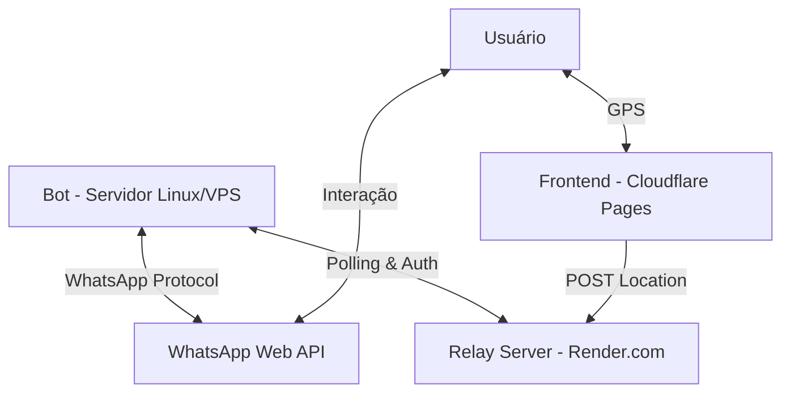

# 🏗️ Arquitetura do Sistema WarriorBlack-Bot

Este documento detalha o fluxo de comunicação e a topografia estratégica do ecossistema do Bot.

## 📡 Visão Geral

O sistema é composto por três pilares integrados que garantem estabilidade, escalabilidade e bypass de limitações geográficas:

---

## 🛠️ Componentes

### 1. Bot Core (O Cérebro)
- **Localização**: Servidor Linux (VPS) via PM2.
- **Tecnologia**: Node.js + `whatsapp-web.js`.
- **Função**: Gerencia comandos, integração com Gemini IA e processa as localizações recebidas do Relay.
- **Identificador PM2**: `WarriorBlack-Bot`.

### 2. Relay (Render - Node.js v20)
**Papel**: Buffer intermediário In-Memory.
- **Tecnologia**: Express.js (Sem SQLite para evitar erros de GLIBC).
- **Armazenamento**: Objetos JS voláteis (Buffer de 500 entradas).
- **Segurança**: Middleware de Pre-flight manual para CORS e validação de `WARRIOR_AUTH_KEY`.

#### Estrutura de Dados (Memória):
- `locations`: `Array<{ id, token, chatId, lat, lng, timestamp, userAgent, processed }>`
- `clients`: `Map<chatId, { lastSeen, totalLocations }>`
- `telemetry`: `Array<{ botNumber, botName, version, timestamp }>`

### 3. Frontend (Cloudflare Pages)
**Papel**: Interface de Coleta.
- **Sanitização**: Lógica de remoção de portas na URL.
- **Headers**: Injeção dinâmica de `x-api-key`.

---

## 🔒 Fluxo de Autenticação (16 chars)
1. Bot gera link com `warriorKey=solano_wb_gps_26`.
2. Frontend lê a chave e envia no header `x-api-key`.
3. Relay valida `received.trim() === expected.trim()`.

1. **Bot -> Relay**: Envia a chave no header `x-api-key` em todas as requisições de Polling.
2. **Frontend -> Relay**: A chave é passada via parâmetro de URL pelo Bot e injetada no header da requisição POST.
3. **Relay**: Valida a chave contra a variável de ambiente (Environment Variable) antes de qualquer processamento.

---

## 📂 Estrutura de Pastas (Topografia)

- `/commands`: Lógica de cada comando do bot (ex: `$pergunta`, `$ondeestou`).
- `/relay`: Código fonte do servidor intermediário (deploy no Render).
- `/public`: Arquivos estáticos do frontend (deploy no Cloudflare).
- `/scripts`: Ferramentas de manutenção e testes.
- `/docs`: Documentação técnica e estratégica.
- `/services`: Integrações externas (IA Gemini, etc).

---

## 🚀 Ciclo de Vida de uma Localização

1. Usuário digita `$ondeestou`.
2. Bot gera um link único (Token + ChatId + Key) e envia ao usuário.
3. Usuário abre o link no Cloudflare Pages.
4. Frontend captura GPS e faz POST para o Relay.
5. Relay armazena no SQLite.
6. Bot faz Polling no Relay, encontra o dado e envia o mapa no WhatsApp.
7. O dado é marcado como processado e limpo após 24h.
